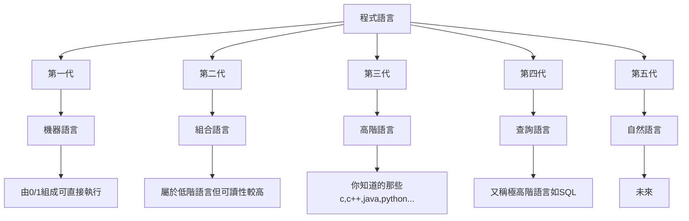
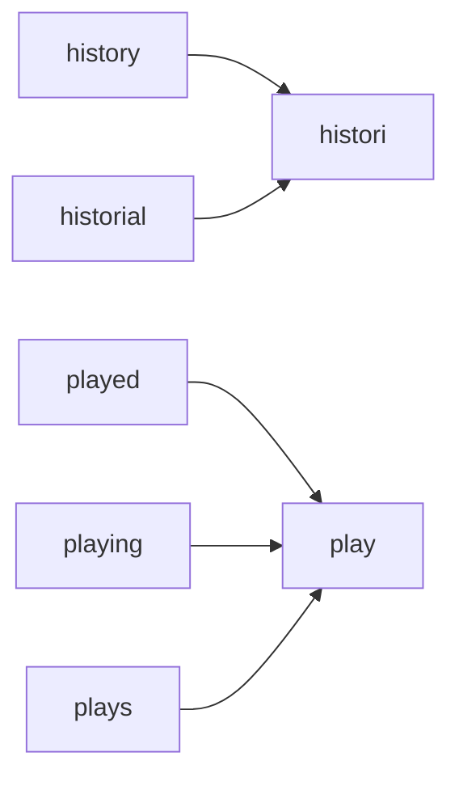
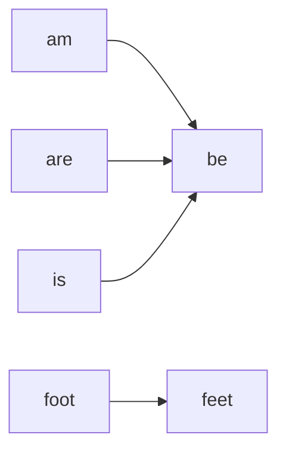

# NLP
Natural Language Processing 自然語言處理
自然語言為第五代語言

## [Bag-of-words(BOW)](https://github.com/soondro2266/NLP/blob/main/Code/Bag-of-word.py)
在一群句子中，可以將所有字列成一個清單(Bag),再用向量來表示每一個句子出現每一個字的數量(向量長度為清單大小)。

### 舉例

```python=
#data
"i love the book"
"this is a great book"
"the fit is great"
"i love the shoes"

#bag
["i", "love", "the", "book", "this","is", "a", "great", "fit", "shoes"]

#vector
[[1 1 1 1 0 0 0 0 0 0]
 [0 0 0 1 1 1 1 1 0 0]
 [0 0 1 0 0 1 0 1 1 0]
 [1 1 1 0 0 0 0 0 0 1]]
```
但實作上bag會自動省略一些常出現的字,例如:"i", "a"
而vector有時也會選擇使用binary模式(有無出現)
### 實作
```python=
from sklearn.feature_extraction.text import CountVectorizer

train_data = [
    "i love the book",
    "this is a great book",
    "the fit is great",
    "i love the shoes"
]

vectorizer = CountVectorizer(binary=True) #build the vectorizer
vectors = vectorizer.fit_transform(train_data) #use train_data to make bag
print(vectorizer.get_feature_names()) #bag list
print(vectors.toarray()) #show each vector

#result
'''
['book', 'fit', 'great', 'is', 'love', 'shoes', 'the', 'this']
[[1 0 0 0 1 0 1 0]
 [1 0 1 1 0 0 0 1]
 [0 1 1 1 0 0 1 0]
 [0 0 0 0 1 1 1 0]]
'''
```
上面就是使用sklearn將字串建構為BOW的方式，而第10行binary選項可以將出現兩次以上的值設為1
### 應用
```python=
from sklearn.feature_extraction.text import CountVectorizer
from sklearn import svm

class Category:
    BOOKS = "BOOKS"
    CLOTHING = "CLOTHING"
       
x_data = ["i love the book",
          "this is a great book",
          "the fit is great",
          "i love the shoes"]
y_data = [Category.BOOKS, Category.BOOKS, Category.CLOTHING, Category.CLOTHING]

vectorizer = CountVectorizer(binary=True) #build the vectorizer
x_vectors = vectorizer.fit_transform(x_data) #use x to make bag

clf_svm = svm.SVC(kernel='linear') #build a classifier
clf_svm.fit(x_vectors, y_data) 

test_data = [
    "i like the book",
    "the shoes is great",
    "i love the pants",
    "the book is great",
    "shoes are alright"
]

for text in test_data:
    vector = vectorizer.transform([text]) #transform test_data to vector
    result = clf_svm.predict(vector) #use vector to predict result
    print(result)
    
#result
'''
['BOOKS']
['CLOTHING']
['CLOTHING']
['BOOKS']
['CLOTHING']
'''
```
以上就是利用BOW做一個<font color="red">簡單</font>的預測，當然還是會有很多錯誤，如果出現一些沒出現的單字就會出錯，甚至只是複數型態(+s)。

**python code**
```python=29
test_data = [
    "i love the books",
    "i love the story",
]

for test in test_data:
    vector = vectorizer.transform([test]) #transform test_data to vector
    result = clf_svm.predict(vector) #use vector to predict result
    print(result)
    
#result
'''
['CLOTHING']
['CLOTHING']
'''
```
### 補充
在生成Bag也不一定要以一個詞為一組，例如在分析情緒時``"great","not great"``意思就差很多，所以我們可以做以下修改:
```python=
from sklearn.feature_extraction.text import CountVectorizer

train_data = [
    "i love the book",
    "this is a great book",
    "the fit is great",
    "i love the shoes"
]

vectorizer = CountVectorizer(binary=True, ngram_range=(1,2)) #build the vectorizer
vectors = vectorizer.fit_transform(train_data) #use train_data to make bag
print(vectorizer.get_feature_names()) #bag list
print(vectors.toarray()) #show each vector

#result
'''
['book', 'fit', 'fit is', 'great', 'great book', 'is', 'is great', 'love',
 'love the', 'shoes', 'the', 'the book', 'the fit', 'the shoes','this','this is']
[[1 0 0 0 0 0 0 1 1 0 1 1 0 0 0 0]
 [1 0 0 1 1 1 1 0 0 0 0 0 0 0 1 1]
 [0 1 1 1 0 1 1 0 0 0 1 0 1 0 0 0]
 [0 0 0 0 0 0 0 1 1 1 1 0 0 1 0 0]]
'''
```

## [Word vectors(詞向量)](https://github.com/soondro2266/NLP/blob/main/Code/word_vector.py)

### 環境架設
```
pip install spacy
python -m spacy download en_core_web_lg
```
lg為large,下載時間大於10分鐘，若不追求準度可以改成md(mid)

### 概述
word vectors 是將句子以向量表示，向量的一個元素代表該類型在句子裡的權重，至於轉換的過程是使用``en_core_web_lg``來完成

### 實作
```python=
import spacy

x_data = ["i love the book",
          "this is a great book",
          "the fit is great",
          "i love the shoes"]

nlp = spacy.load("en_core_web_lg") #model of the word vectors 
doc = [nlp(text) for text in x_data] #build the vector of each sentence

print(doc[0].vector)

#result
[-3.9804751e-01 -1.7059250e+00 -9.0664995e-01 -4.5425000e+00
 -1.1165801e+00 -2.9151249e+00  3.1752450e+00  4.0887251e+00
            ............lots of numbers
  4.4546151e+00 -1.3000700e+00 -2.6352043e+00  1.1399500e+00
  1.8315576e+00 -2.9688001e+00 -7.6453247e+00  8.4300494e-01]
```
此程式為將一個句子轉換成word vectors的範例,因為跟BOW一樣都是向量，所以也可以用類似的方法對句子進行分類，下面為應用
### 應用
```python=
from sklearn import svm
import spacy

class Category:
    BOOKS = "BOOKS"
    CLOTHING = "CLOTHING"
     
x_data = ["i love the book",
          "this is a great book",
          "the fit is great",
          "i love the shoes"]
y_data = [Category.BOOKS, Category.BOOKS, Category.CLOTHING, Category.CLOTHING]

nlp = spacy.load("en_core_web_lg") #model of the word vectors 
doc = [nlp(text) for text in x_data] #build the word vectors of each sentence

clf_svm = svm.SVC(kernel="linear") #build a classifier
clf_svm.fit([x.vector for x in doc], y_data)

test_data = [
    "i like the book",
    "the shoes is great",
    "i love the pants",
    "the book is great",
    "shoes are alright",
    "i love the books",
    "the story is great",
    "the outfit is great"
]

#transform each sentence to word vectors and predict the result 
result = [clf_svm.predict([nlp(sentence).vector]) for sentence in test_data]
for i in result:
     print(i)

#result
'''
['BOOKS']
['CLOTHING']
['CLOTHING']
['BOOKS']
['CLOTHING']
['BOOKS']
['BOOKS']
['CLOTHING']
'''
```

因為是透過spacy的model來構建word vectors, 所以準度就比BOW高很多

## [Regex](https://github.com/soondro2266/NLP/blob/main/Code/regex_train.py)

Regular Expression，是利用一個字串來表示一個句法規則，可以用來比對其他字串是否符合規則
\
[Regex規則](https://cheatography.com/davechild/cheat-sheets/regular-expressions/)
[Regex測試](https://regex101.com/)

### 舉例&實作過程
:::warning
目標:想要找出符合所有開頭為ab，結尾為cd的字串
:::
最簡單的字串為``"abcd"``即:
```python
"abcd"
```
中間可以有任何符號``.``，數量不限``*`` 即:
```python
"ab.*cd"
```
但不能是空格``\s``，而not的形式為``[^\s]``，即:
```python
"ab[^\s]*cd"
```
而要限定aa在句首，bb在句尾，所以要加上句首句尾符號，即:
```python
"^ab[^\s]*cd$"
```
**python code 1**
```python=
import re

regexp = re.compile(r"^ab[^\s]*cd$")

phrases = ["abcd","ab cd", "abrtbkmrbcd", "ffabffcd"]

search_phrases = []
for phrase in phrases:
    if re.search(regexp,phrase):
        search_phrases.append(phrase)

print(search_phrases)

#result
"""
['abcd', 'abrtbkmrbcd']
"""
```
**python code 2**
```python=
import re

regexp = re.compile(r"read|story|book") #無句首句尾

phrases = ["I like that story", "I love the book", "this hat is nice", "read"]

match_phrases = []
search_phrases = []
for phrase in phrases:
    if re.match(regexp,phrase):
        match_phrases.append(phrase)
    if re.search(regexp,phrase):
        search_phrases.append(phrase)

print(match_phrases)
print(search_phrases)

#result
"""
['read']
['I like that story', 'I love the book', 'read']
"""
```
第一份code可以看出句首句尾符號的效果，而第二份code說明match和search的差別，而在第二份code有可能會找到``"history", "tread"``等，所以要加上``\b``來限制，即``r"\bread\b|\bstory\b|\bbook\b"``

**python code**
```python=
import re

regexp = re.compile(r"read|\bstory\b|\bbook\b")

phrases = ["i like the story",
           "i love the history",
           "the book is good",
           "he tread the bug"]

search_phrases = []
for phrase in phrases:
    if re.search(regexp,phrase):
        search_phrases.append(phrase)

print(search_phrases)

#result
"""
['i like the story', 'the book is good', 'he tread the bug']
"""
```
注意這份code的Regex為``r"read|\bstory\b|\bbook\b"``
\
\
Regex的規則很多，就不多做介紹，可以利用Regex尋找文章中是否有目標類型文字

## Stemming and Lemmatization

Stemming(詞幹提取)，Lemmatization(詞行還原)
### 環境架設
```python=
import nltk

nltk.download('wordnet')
nltk.download('stopwords')
nltk.download('punkt')
nltk.download('omw-1.4')
```
如果編譯過程出錯，代表還有其他nltk檔案沒載，都去載一載吧
### [Stemming](https://github.com/soondro2266/NLP/blob/main/Code/stemming.py)


上圖為Stemming的流程，將一個<font color="red">**字串**</font>的詞幹提取出來，而一個句子由許多單字組合，所以需要將句子拆解為多個單字(tokenize)

**python code**
```python=
from nltk.tokenize import word_tokenize
from nltk.stem import PorterStemmer

stemmer = PorterStemmer()

phrase = "reading the books"
words = word_tokenize(phrase)

print(words)

stemmed_words = []
for word in words:
    stemmed_words.append(stemmer.stem(word))

print(stemmed_words)

#result
"""
['reading', 'the', 'books']
['read', 'the', 'book']
"""
```
**What is tokenize?**
tokenize是在英文裡的一個用法，我也不知道怎麼翻，跟spilt(用空格分割)的差別是``didn't``經過``word_tokenize``後會變成``did``和``n't``，而spilt則無法分割。

### [Lemmatization](https://github.com/soondro2266/NLP/blob/main/Code/lemmatization.py)

上圖為Lemmatization的流程，將一個<font color="red">**字串**</font>的詞型還原，當然句子也要先經過tokenize

**python code**
```python=
from nltk.tokenize import word_tokenize
from nltk.stem import WordNetLemmatizer

lemmatizer = WordNetLemmatizer()

phrase = "The striped bats are hanging on their feet for best"
words = word_tokenize(phrase)

lemmatized_words = []
for word in words:
    lemmatized_words.append(lemmatizer.lemmatize(word))

print(lemmatized_words)

#result
"""
['The', 'striped', 'bat', 'are', 'hanging', 'on', 'their', 'foot', 'for', 'best']
"""
```
問題來了，可以發現are並沒有被還原成be,原因是因為lemmatize的時候要傳入要還原成的詞性(part of speech)，稱為 POS tag
\
所以我們先來看看POS tag的形式吧

**python code**
```python=
import nltk
from nltk.tokenize import word_tokenize

phrase = "The striped bats are hanging on their feet for best"
words = word_tokenize(phrase)

pos_tags = nltk.pos_tag(words)

for pos_tag in pos_tags:
    print(pos_tag)

#result
"""
('The', 'DT')
('striped', 'JJ')
('bats', 'NNS')
('are', 'VBP')
('hanging', 'VBG')
('on', 'IN')
('their', 'PRP$')
('feet', 'NNS')
('for', 'IN')
('best', 'JJS')
"""
```
POS tag 的第一位代表詞性，而lemmatize所需要傳入的為``"v","n","a","r"``代表verb, noun, adjective, adverb，所以只要寫一個函式轉換POS tag並傳入lemmatize就可以了

**python code**
```python=
import nltk
from nltk.tokenize import word_tokenize
from nltk.stem import WordNetLemmatizer

def get_wordnet_pos(word):
    tag = nltk.pos_tag([word])[0][1][0].lower()
    if tag not in ['n', 'v', 'a', 'r']:
        return "n"
    return tag

lemmatizer = WordNetLemmatizer()
phrase = "The striped bats are hanging on their feet for best"
words = word_tokenize(phrase)

lemmatized_words = []
for word in words:
    lemmatized_words.append(lemmatizer.lemmatize(word, get_wordnet_pos(word)))

print(lemmatized_words)

#result
"""
['The', 'strip', 'bat', 'be', 'hang', 'on', 'their', 'foot', 'for', 'best']
"""
```

## Stopwords Removal

為了節省儲存空間和提高搜尋速度，會把文章裡比較沒有意義的文字移除掉，稱為stopwords， 而nltk裡有內建的英文stopwords list

**python code**
```python=
from nltk.corpus import stopwords

stop_words = stopwords.words('english')
print(stop_words)

#result
'''
['i', 'me', 'my', 'myself', 'we', 'our', 'ours',
'ourselves', 'you', "you're", "you've", "you'll",
"you'd", 'your', 'yours', 'yourself', 'yourselves',
'he', 'him', 'his', 'himself', 'she', "she's",
'her', 'hers', 'herself', 'it', "it's", 'its',
'itself', 'they', 'them', 'their', 'theirs', 
'themselves', 'what', 'which', 'who', 'whom', 'this',
'that', "that'll", 'these', 'those', 'am', 'is', 'are',
'was', 'were', 'be', 'been', 'being', 'have', 'has',
'had', 'having', 'do', 'does', 'did', 'doing', 'a',
'an', 'the', 'and', 'but', 'if', 'or', 'because', 'as',
'until', 'while', 'of', 'at', 'by', 'for', 'with',
'about', 'against', 'between', 'into', 'through',
'during', 'before', 'after', 'above', 'below', 'to', 
'from', 'up', 'down', 'in', 'out', 'on', 'off', 'over',
'under', 'again', 'further', 'then', 'once', 'here',
'there', 'when', 'where', 'why', 'how', 'all', 'any',
'both', 'each', 'few', 'more', 'most', 'other', 'some', 
'such', 'no', 'nor', 'not', 'only', 'own', 'same', 'so',
'than', 'too', 'very', 's', 't', 'can', 'will', 'just',
'don', "don't", 'should', "should've", 'now', 'd', 'll',
'm', 'o', 're', 've', 'y', 'ain', 'aren', "aren't", 
'couldn', "couldn't", 'didn', "didn't", 'doesn', "doesn't",
'hadn', "hadn't", 'hasn', "hasn't", 'haven', "haven't",
'isn', "isn't", 'ma', 'mightn', "mightn't", 'mustn', 
"mustn't", 'needn', "needn't", 'shan', "shan't", 'shouldn',
"shouldn't", 'wasn', "wasn't", 'weren', "weren't", 'won',
"won't", 'wouldn', "wouldn't"]
'''
```
\
所以只要將句子tokenize之後刪掉stopwords就好了

**python code**
```python=
from nltk.tokenize import word_tokenize
from nltk.corpus import stopwords

phrase = "Here is an example sentence demonstrating the removal of stopwords"
stop_words = stopwords.words('english')

words = word_tokenize(phrase)

stripped_phrase = []
for word in words:
    if word not in stop_words:
        stripped_phrase.append(word)

print(" ".join(stripped_phrase))

#result
"""Here example sentence demonstrating removal stopwords"""
```


## More Techniques (TextBlob)

[**TextBlob API Reference**](https://textblob.readthedocs.io/en/dev/api_reference.html)
\
TextBlob有許多的套件可以使用，如下
\
回傳 [POS tag](https://www.ling.upenn.edu/courses/Fall_2003/ling001/penn_treebank_pos.html) 和 sentiment
```python=
from textblob import TextBlob

phrase = "the book was horrible"

tb_phrase = TextBlob(phrase)

print(tb_phrase.tags)

print(tb_phrase.sentiment)

#result
'''
[('the', 'DT'), ('book', 'NN'), ('was', 'VBD'), ('horrible', 'JJ')]
Sentiment(polarity=-1.0, subjectivity=1.0)
'''
```
correct the misspelling
```python
from textblob import TextBlob

phrase = "thje bookk was horrriblee"

tb_phrase = TextBlob(phrase)

print(tb_phrase.correct())

#result
'''
the book was horrible
'''
```
```cpp
int seg[4][4*N],seg2[4][4*N],lzadd[4][4*N],lzmod[4][4*N];
bool mod[4][4*N],mod2[4][4*N];
```
因為看到這個神奇的correct功能，所以就心血來潮了試了之前看過的文章:
```
I cuold not bvleiee taht I culod aulaclty uesdtannrd
waht I was rdnaieg.Unisg the icndeblire pweor of the
hmuan mnid, aocdcrnig to rseecrah at Cmabrigde
Uinervtisy, it deos not mttaer in waht oderr the lterets
in a wrod are, the olny irpoamtnt tihng is taht the frsit 
and lsat ltteer be in the rhgit pclae. The rset can be a 
taotl mses and you can sitll raed it whoutit a pboerlm.
Tihs is bucseae the huamn mnid deos not raed ervey ltteer 
by istlef, but the wrod as a wlohe.
```

結果......

```
I could not bvleiee that I could audacity uesdtannrd
what I was rdnaieg.Unisg the icndeblire power of the
human mind, aocdcrnig to rseecrah at Cmabrigde
Uinervtisy, it does not matter in what oder the streets
in a word are, the only irpoamtnt thing is that the fruit
and last later be in the right place. The set can be a
tall mess and you can still red it whoutit a pboerlm.
His is bursae the human mind does not red even later
by itself, but the word as a whole.
```
完全不行XD, 但很顯然第一個文章是可閱讀的，歡迎各位分析這篇神奇文章
\
TextBlob還有tokenize等超多功能，API都有介紹，就不多做說明


## 參考資料
[Complete Natural Language Processing Tutorial in Python!](https://www.youtube.com/watch?v=M7SWr5xObkA)
[NLP in Python!](https://github.com/KeithGalli/pycon2020)