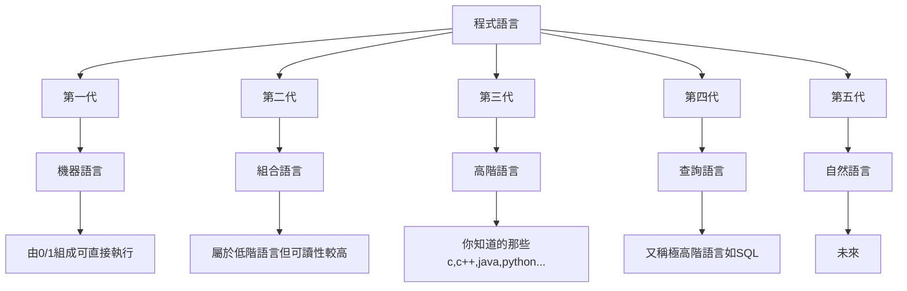

# NLP
Natural Language Processing 自然語言處理
自然語言為第五代語言

## Bag-of-words(BOW)
在一群句子中，可以將所有字列成一個清單(Bag),再用向量來表示每一個句子出現每一個字的數量(向量長度為清單大小)。

### 舉例
```python=
#data
"i love the book"
"this is a great book"
"the fit is great"
"i love the shoes"

#bag
["i", "love", "the", "book", "this","is", "a", "great", "fit", "shoes"]

#vector
[[1 1 1 1 0 0 0 0 0 0]
 [0 0 0 1 1 1 1 1 0 0]
 [0 0 1 0 0 1 0 1 1 0]
 [1 1 1 0 0 0 0 0 0 1]]
```
但實作上bag會自動省略一些常出現的字,例如:"i", "a"
而vector有時也會選擇使用binary模式(有無出現)
### 實作
```python=
from sklearn.feature_extraction.text import CountVectorizer

train_data = [
    "i love the book",
    "this is a great book",
    "the fit is great",
    "i love the shoes"
]

vectorizer = CountVectorizer(binary=True)
vectors = vectorizer.fit_transform(train_data)
print(vectorizer.get_feature_names())
print(vectors.toarray())

#result
'''
['book', 'fit', 'great', 'is', 'love', 'shoes', 'the', 'this']
[[1 0 0 0 1 0 1 0]
 [1 0 1 1 0 0 0 1]
 [0 1 1 1 0 0 1 0]
 [0 0 0 0 1 1 1 0]]
'''
```


## 參考資料
[Complete Natural Language Processing Tutorial in Python!](https://www.youtube.com/watch?v=M7SWr5xObkA)
[NLP in Python!](https://github.com/KeithGalli/pycon2020)